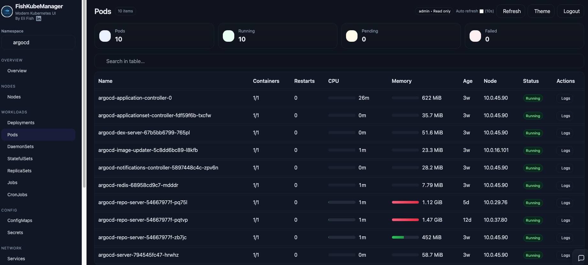
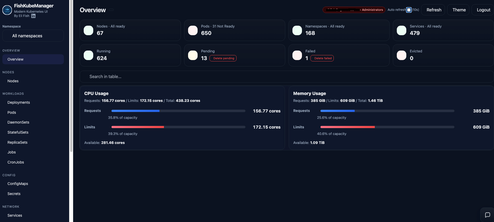
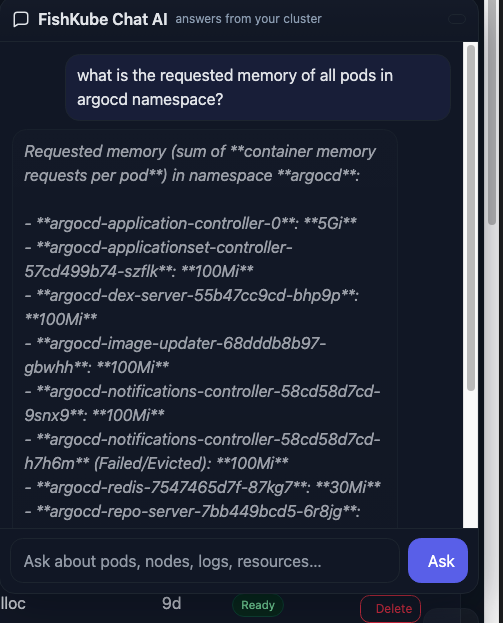

# FishKube Manager


FishKube Manager is a modern SAAS Kubernetes management dashboard, featuring frontend and a Helm chart for Kubernetes deployment.

It focuses on operational visibility, safe resource management, and optional AI assisted cluster interactions.


## Features
- Cluster or namespace overview dashboard
- Resource browsing for core Kubernetes objects
- Modern logs viewer
- YAML viewer and editor with RBAC
- Local and Google OAuth authentication
- Optional AI assistant for cluster operations
- Optional external monitoring links (Grafana)

## Screenshots





- Dashboard overview
- Pods table and resource usage
- Logs viewer
- YAML editor
- Chat AI assistant



## Quick Start

### Kubernetes
```bash
helm upgrade --install fishkube-manager ./helm \
  -n fishkube-manager --create-namespace
```

## Configuration reference (env vars)

### Core / DB / sessions
- **`FKM_SECRET`**: Flask session secret key (set a strong value in prod)
- **`FKM_DB`**: SQLite DB path (default `/data/users.db`)
- **`FKM_SCALE_WAIT`**: max wait seconds for scaling ops (default `45`)
- **`FKM_CHAT_BUDGET`**: max request budget seconds for Chat AI loop (default `50`)

### Bootstrap users
- **`FKM_BOOTSTRAP_USER`**, **`FKM_BOOTSTRAP_PASS`**: created when DB has no users yet
- **`BOOTSTRAP_ADMIN`**, **`BOOTSTRAP_PASSWORD`**: recovery path (forces role=admin on login)

The app also auto-repairs configured bootstrap usernames to `role=admin` on startup.

### Authentication provider
- **`FKM_AUTH_PROVIDER`**: `local` | `google`
- **`GOOGLE_CLIENT_ID`**, **`GOOGLE_CLIENT_SECRET`**
- **`GOOGLE_ALLOWED_DOMAIN`**: optional email domain restriction
- **`FKM_OAUTH_REDIRECT_URI`**: optional explicit redirect URI
- **`FKM_COOKIE_DOMAIN`**: cookie domain override
- **`FKM_SESSION_COOKIE_NAME`**: session cookie name override
- **`FKM_ALLOW_LOCAL_WITH_GOOGLE`**: `true|false` (default true)

### Pod “Resources usage monitoring” external link (Grafana)
- **`FKM_EXTERNAL_MONITORING_URL_BTN`**: `true|false` (if false, button is hidden)
- **`FKM_MONITORING_BASE_URL`**: e.g. `https://grafana.example.com/`
- **`FKM_MONITORING_QUERY_TEMPLATE`**: path+query, supports `<namespace>` placeholder

Example template:
`/d/<UID>/kubernetes-compute-resources-namespace-workloads?...&var-namespace=<namespace>&var-type=All`

### Pod usage data source
- **`FKM_PROM_URL`** (or `PROM_URL`): Prometheus base URL to enable 1h average CPU/memory in pods table.
- Without Prometheus, Overview can show **current node usage** if **metrics-server** is installed.

### Chat AI provider selection
- **`FKM_AI_PROVIDER`**: `openai` (default) | `gemini` | `bedrock_anthropic`

OpenAI:
- **`OPENAI_API_KEY`**
- **`OPENAI_MODEL`** (e.g. `gpt-5.2`)
- **`OPENAI_TEMPERATURE`** (ignored for `gpt-5*` models)

Gemini:
- **`GEMINI_API_KEY`**
- **`GEMINI_MODEL`** (e.g. `gemini-1.5-pro`)

AWS Bedrock (Anthropic Claude):
- **`AWS_REGION`**
- **`BEDROCK_MODEL_ID`** (e.g. `anthropic.claude-3-5-sonnet-20240620-v1:0`)
- Credentials via IRSA / node role / env credentials; needs `bedrock:InvokeModel`

---

## Helm values (what to edit)

See `helm/values.yaml` for defaults and `helm/value-*.yaml` for environment overlays.

Key sections:
- `authProvider`: local vs google auth
- `persistence`: PVC size/mountPath/storageClassName
- `env`: operational env vars (Prometheus URL, monitoring URL button, etc.)
- `ai`: provider selection + credentials/models

Security:
- Do **not** commit real API keys to git.
- Prefer Kubernetes Secrets for `OPENAI_API_KEY`, `GEMINI_API_KEY`, and Google OAuth secrets.

---

## License
Apache License 2.0
